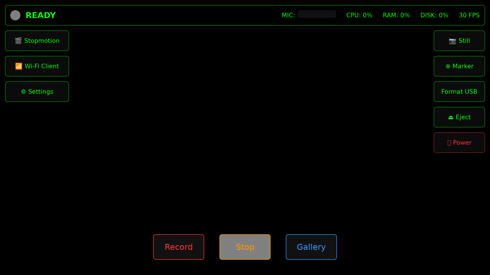
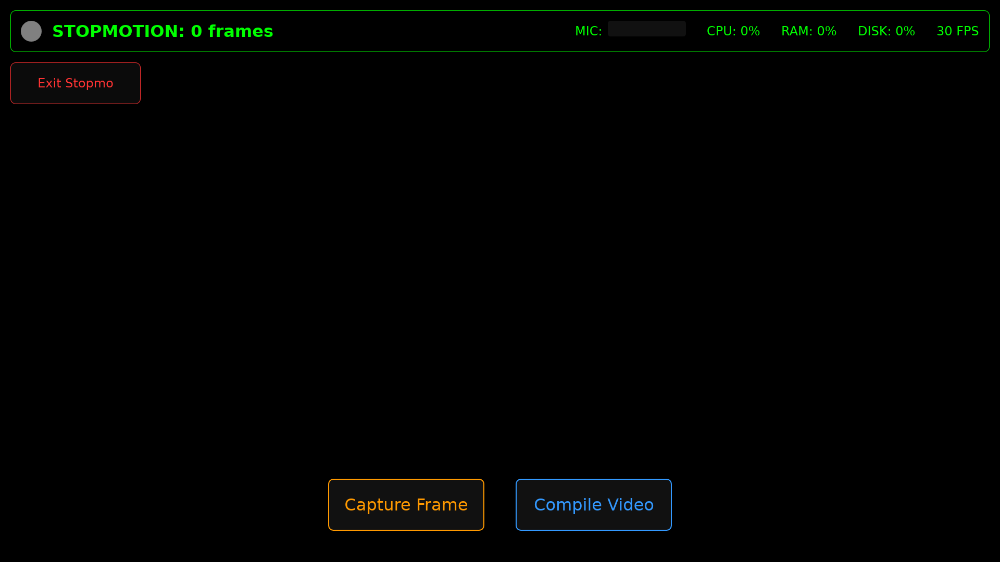
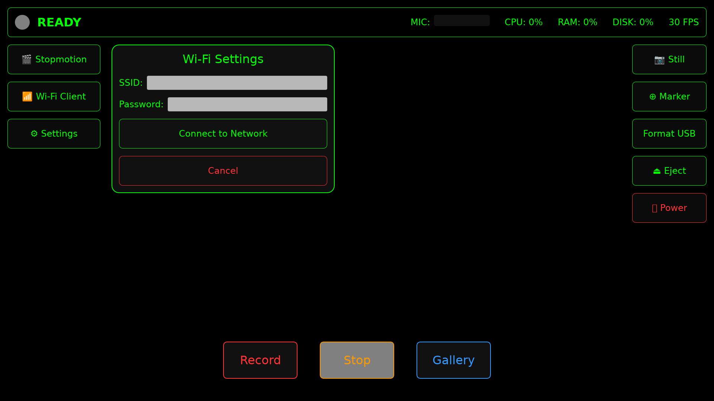
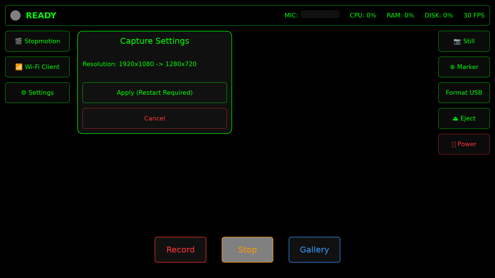
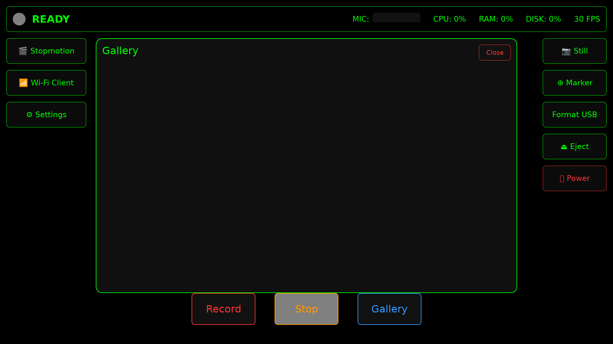

# Antigravity DVR System

A highly resilient, hardware-accelerated DVR system built on Alpine Linux and Rust. Designed primarily for automotive dashcams and continuous video recording appliances.

## Features

- **Instant Boot:** Extremely fast, clean boot via `fbsplash` directly into the UI.
- **Resilient OS:** Read-only root filesystem (`aarch64`) with `tmpfs` mounts to completely eliminate SD card corruption on sudden power loss.
- **Hardware Acceleration:** Zero-copy KMS/DRM rendering and V4L2 H264 hardware video encoding (`tc358743` HDMI to CSI-2 support).
- **Audio Capture:** I2S Audio capture multiplexed directly into the MP4 container.
- **Continuous Loop Recording:** Seamless video segmentation (`splitmuxsink`) and auto-deletion of oldest files when storage hits 90%.
- **Modern Touch UI:** Slint-based dashboard displaying live preview, telemetry (FPS, CPU usage, Disk, RAM), and recording controls.
- **Timeline Markers:** Instantly inject timestamp markers into `markers.txt` and directly into the MP4 file metadata (GStreamer Tags).
- **Wireless Retrieval:** Built-in WiFi Access Point (`DVR_DASHCAM_AP`) and Axum-based HTTP server for mobile video downloads over WLAN.

## UI Screenshots

The following screenshots are automatically generated during the CI build process to reflect the latest UI state:

### Main Dashboard


### Stopmotion Mode


### Wi-Fi Client Mode


### Capture Settings


### Gallery


## Project Structure

- `build_os.sh`: The master script that generates the flashable `.img` via `alpine-make-rootfs`.
- `dvr_app/`: The Rust application that powers the UI and video pipeline.
- `.github/workflows/build-os.yml`: Fully automated CI pipeline that tests, builds, and publishes flashable images via GitHub Releases.

## CI/CD Pipeline

This project is equipped with a GitHub Actions workflow that automatically triggers on pushes to the `main` branch or when a new tag is pushed.

1. **Build Environment:** Uses `ubuntu-latest` with QEMU `linux/arm64` cross-compilation Docker images.
2. **Application Compilation:** The DVR Rust application is compiled strictly in its own isolated `aarch64` Alpine container.
3. **OS Generation:** The `build_os.sh` script constructs the read-only OS partitions and injects the pre-compiled Rust binary natively, creating a single, fully-integrated artifact: `dvr_alpine_aarch64_[VERSION].img`.
4. **Artifact Versioning:** Images are tagged automatically. Pushes to `main` use the short commit SHA (e.g. `1a2b3c4`), while GitHub tags (e.g. `v1.0.0`) use the semantic tag string.
5. **Release:** Compresses the `.img` to `.tar.gz` and publishes them directly to the GitHub Releases page.

## How to Flash

1. Go to the [Releases](https://github.com/sloev/dvr/releases) page and download the latest `dvr_alpine_aarch64.img.tar.gz`.
2. Extract the archive.
3. Flash the `.img` to a high-endurance SD Card using BalenaEtcher or `dd`:
   ```bash
   sudo dd if=dvr_alpine_aarch64.img of=/dev/sdX bs=4M status=progress
   ```
4. Insert into the Raspberry Pi and power on.

## Advanced Features Status

All major features have been successfully migrated to native Rust:
- **✅ Capturing Stills**
- **✅ Timeline Markers (With MP4 Tag Injection)**
- **✅ USB Formatting (F2FS) & Ejection**
- **✅ Power Controls**
- **✅ Stopmotion Mode (Multiple Projects & Hardware MP4 Compilation)**
- **✅ On-Device Playback (Gallery via MPV/GStreamer playbin)**
- **✅ Wi-Fi Client Mode & OSK Support**
- **✅ Dynamic Capture Settings**
