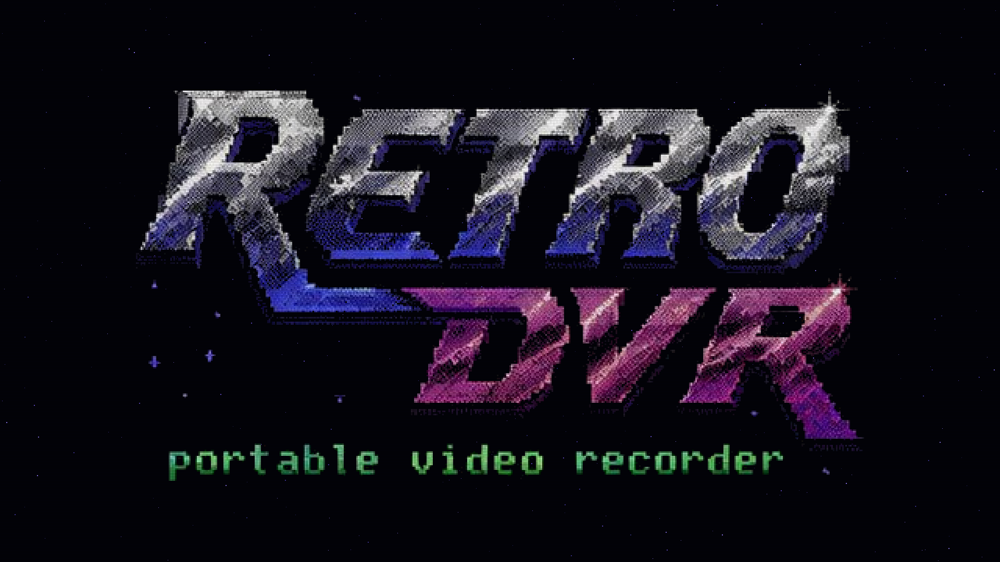

<div align="center">



# 📼 DVR

### A lo-fi, DIY field recorder for old camcorders.

*Hi8 → HDMI → Raspberry Pi → 1080p H.264 on a USB stick.*
*A pocket Atomos for tapes.*

[](https://github.com/sloev/dvr/actions/workflows/build-image.yml)
[](https://github.com/sloev/dvr/releases/tag/rolling)


</div>

---

```
┌─────────────────────────────────────────────┐
│ ●live  1920×1080 25p      12:04:53:11   48°C │
│                                              │
│            ( live HDMI preview )             │
│                                              │
│ ●REC  12.3GB  ▓▓░  ⊕ ▶ ⏏ WiFi ⚙ ⏻          │
└─────────────────────────────────────────────┘
```

A 800×480 touchscreen, a live preview that's **always on**, and one big red
button. Plug in a tape deck, hit record, pull the power when you're done.

## ✨ Features

- 🎥 **1080p hardware H.264** — the Pi's GPU does the encoding, the CPU stays cool
- 🔊 **Stereo audio** over I2S, straight from the capture board
- 👆 **Touch UI** rendered on top of the GPU preview — no compositor, no lag
- 💾 **Records to USB**, safe-eject button, never touches the SD card
- ▶️ **Playback** old clips, drop **scene markers**, auto-split long takes
- 📶 **Wi-Fi** manager with a growing list of saved hotspots
- 🔒 **Read-only SD** — just yank the power, nothing to corrupt
- ⚡ **Boots fast**, autostarts the app, no desktop
- ⚙️ **Resolution** switchable on-screen, persisted across reboots

## 🚀 Get it running

1. Grab the latest **[`rolling` image](https://github.com/sloev/dvr/releases/tag/rolling)**
2. Flash with **Raspberry Pi Imager** → *Use custom image* (set Wi-Fi + country in the gear menu)
3. Wire it up:

   ```
   Hi8 cam ──CVBS──► HDMI upscaler ──HDMI──► TC358743 (C790) ──CSI-2──► Pi
                                                    └──I2S audio──────────┘
                                       DSI 800×480 touchscreen ──────────► Pi
   ```
4. Power on. First boot self-provisions and reboots once; after that you're live.

## 🛠️ Hardware

| | |
|---|---|
| **SBC** | Raspberry Pi 2B / 3B (32-bit) |
| **Capture** | HDMI→CSI-2 C790 — Toshiba TC358743 |
| **Display** | iPistBit DSI 800×480 capacitive touch |
| **Storage** | any USB drive (records as MP4) |

## 🧱 Build it yourself

The whole OS is a reproducible [pi-gen](pi-gen/README.md) build — CI bakes a fresh
image on every push to `master`:

```bash
cd pi-gen && ./build.sh        # → deploy/dvr-*.img.xz
```

## 🧩 How it works

One GStreamer pipeline: `v4l2src → tee →` preview *(GPU)* `+` a record branch
*(hardware encode → MP4)* spun up on demand. A lean **Tkinter** overlay draws the
UI straight onto the preview window — the same GPU-overlay trick as
`picamera.start_preview()`. No Qt, no Wayland, no nonsense.

<div align="center">
<sub>Built for tape rats and lo-fi archivists. 📼</sub>
</div>
